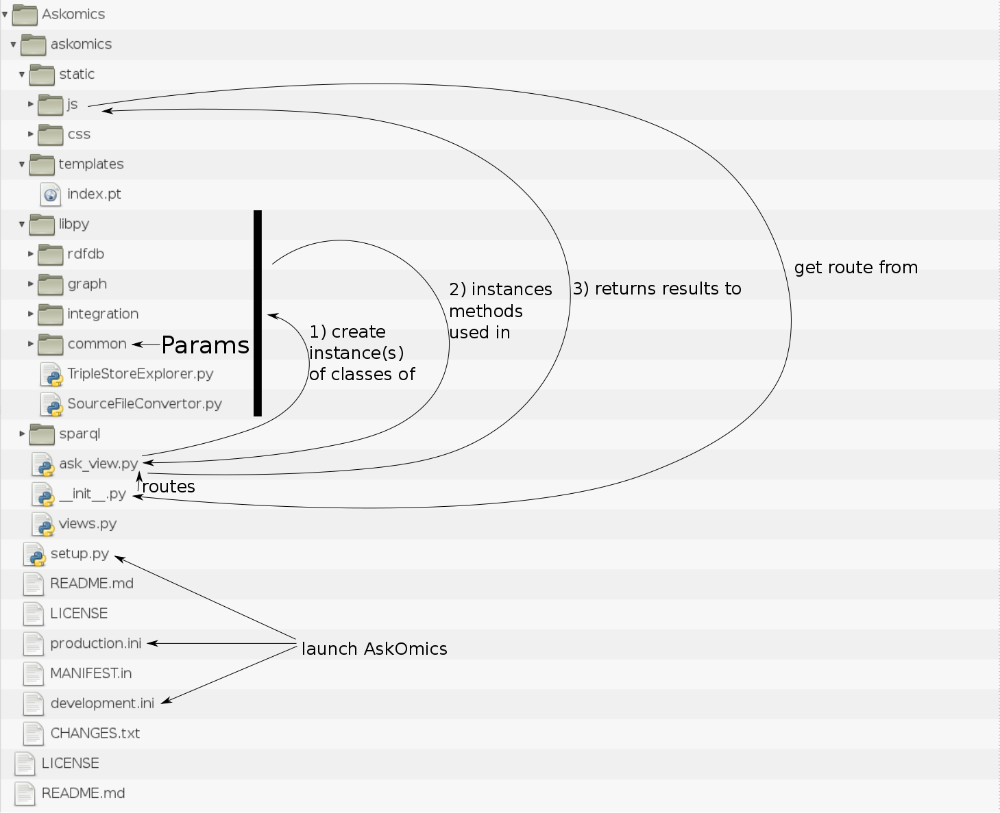

AskOmics is a visual SPARQL query builder and data integrater for RDF database. The user can build queries and convert tabulated data to turtle files on a web interface (HTML5/jquery). This interface communicates with a python library using a REST api provided by a Pyramid framework. The python library translates the user choices to sparql queries, send them to a triple store and return the results.

1) HTML5 / Jquery / Python interactions

Here we explain how works the communication between the different technologies we used. As example, let see what happen when the AskOmics website is loaded (it's he same principle for every jquery - python interaction).

The HTML code of the interface is located in rdf-visual-query-builder/Askomics/askomics/templates/index.pt. A jquery function located in rdf-visual-query-builder/Askomics/askomics/static/js/askomics.js is loaded at start to modify this code, filling the #startpoints div with the entity of the database set as startpoints. This function call a service provided by the python library through Pyramid:

```
    var service = new RestServiceJs("startpoints")
```

All services are defined in two files: rdf-visual-query-builder/Askomics/askomics/\_\_init\_\_.py and rdf-visual-query-builder/Askomics/askomics/ask_view.py.
The line "config.add_route('start_point', '/startpoints')" of \_\_init\_\_.py allows to call the "start_point @view_config" of ask_view.py which have a single function. This function uses a class of the python library to get the startpoints and return them to the jquery code in a dictionary called "data" in ask_view.py and "startPointsDict" in a callback function of askomics.js that fill the #startpoints div:

```
    service.getAll(function(startPointsDict) {
        ...
        $.each(startPointsDict.nodes, function(key, value) {
            $("#startpoints").append($("<option></option>").attr("data-value", JSON.stringify(value)).text(value.label));
        });
        ...
    });
```

All jquery - python transactions follow this model :

```
script.js   <== get route from ==> __init__.py <== follow route in ==> ask_view.py <== create instance(s) of classes of ==> libaskomics module
  ^^                                                                 ask_view.py <== uses methods of these classes to obtain ==> results in a dictionary
  ||                                                                                                                                             ^^
  ||                                                                                                                                             ||
   ========================================= used as argument of a callback function of ==========================================================
```

The services can be of 5 types defined in rdf-visual-query-builder/Askomics/askomics/static/js/rest.js: post, update, get, getAll and remove.
Aside from the callback function, an argument can be set when calling a service to send data from jquery to python. In this example, we send the "model" dictionary to python:

```
    var service = new RestServiceJs("get_value");
    var model = { 'uri': attributes[i].typeUri };
    service.post(model, function(d) {
        var datalist = $("<datalist></datalist>").attr("id", "opt_" + id);
        for (v of d.value) {
            datalist.append($("<option>").attr("value", v));
        }
        inp.append(datalist);
    });
```

AskOmics always follows this model and is consequently organized:




2) Ask! and Integrate tabs

The Ask! tab is display by default when loading AskOmics website. It uses askomics.js, bootstrap.js (web responsive framework), graph.js (dependent on d3.js), query-handler.js and rest.js javascript files and the TripleStoreExplorer.py of libaskomics alongside with the classes in graph and rdfdb folders. The sparql folder contains the templates of the sparql queries used to assist the user in the query building process.

The Integrate tab uses askomics.js, bootstrap.js, integration.js and rest.js javascript files and the SourceFileConvertor.py alongside with the classes in the integration folder.

Both tabs also use rdf-visual-query-builder/Askomics/askomics/libaskomics/common/params.


3) File conversion, loading data in triple store and launching database

Files to convert must be placed in rdf-visual-query-builder/Askomics/askomics/files.
The Integrate tab will then display an overview (10 first lines) of each file.
The user has to set the type of each field, then he can hit the "Convert to turtle" button.
If the database is not up during this process, AskOmics will display a "request fail" alert when choosing the type of a field.
Indeed, AskOmics interrogates the database in order to compare the new data with those already in the database in order to report new, missing and correct headers.
For the first conversion, you should launch an empty database to avoid this alert.
The output files are in rdf-visual-query-builder/Askomics/askomics/results.
The turtle files can be loaded in a fuseki triple store using [apache-jena tdbloader command] (https://jena.apache.org/documentation/serving_data/#download-fuseki1).

```
./tdbloader --loc=/database/folder/accessible/by/fuseki/ /turtle/folder/accessible/by/fuseki/*.ttl
```

Then you can launch the database with:
```
./fuseki-server --loc=/database/folder/accessible/by/fuseki/ /databaseName > /log/folder/accessible/by/fuseki/databaseName.log &
```
